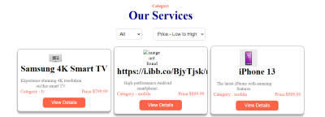

# Easy Shop



Easy Shop is an e-commerce web application built with React, styled-components, and react-icons. It offers a seamless shopping experience for a range of electrical products, including mobile phones, TVs, and laptops.

## Table of Contents

- [Getting Started](#getting-started)
  - [Prerequisites](#prerequisites)
  - [Installation](#installation)
- [Usage](#usage)
- [Contributing](#contributing)
- [License](#license)
- [Contact](#contact)

## Getting Started

Follow these steps to set up and run Easy Shop on my local machine.

### Prerequisites

Before i begin, ensure i have the following software and tools installed:

- [Node.js](https://nodejs.org/) 
- [npm](https://www.npmjs.com/) 

### Installation

1. **Clone the repository:**

   ```bash
   git clone https://github.com/saifulaija/easy-shop-bd
